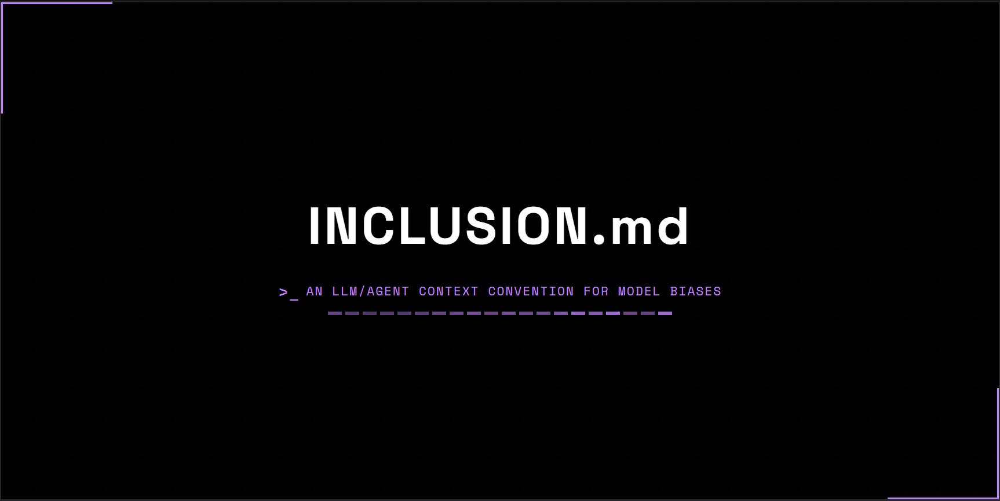

# inclusion.md

> A repository-level context engineering document for inclusive AI-assisted
> software development.

[**Read INCLUSION.md →**](./INCLUSION.md) · [npm](https://www.npmjs.com/package/inclusion-md) · [companion essay](https://branon.dev/blog/posts/the-need-for-inclusion-md)

---

## What it is

`INCLUSION.md` is a drop-in file that gives AI coding assistants — GitHub
Copilot, Cursor, Claude Code, Windsurf, Continue, and friends — persistent,
inclusion-oriented guidance during code generation.

It's the inclusion-focused sibling of `A11Y.md`, `CONTRIBUTING.md`, and
`design.md`:

| File              | Operationalizes                                        |
| ----------------- | ------------------------------------------------------ |
| `README.md`       | What this project is                                   |
| `CONTRIBUTING.md` | How humans contribute                                  |
| `A11Y.md`         | Technical accessibility compliance                     |
| `design.md`       | Visual and interaction system                          |
| `INCLUSION.md`    | Contextual, representational, sociotechnical inclusion |

## Why it exists

AI coding assistants now sit _between_ human intent and the code, copy, and
interactions that ship. They generate output based on what's statistically
likely given training data — which carries the accumulated biases of the
public web, open-source code, and English-language text. That means
assistants quietly amplify two kinds of debt:

- **Accessibility debt** — inaccessible patterns inherited from the public web.
- **Representational debt** — narrow assumptions about whose communication
  styles, identities, and lived experiences count as "default."

Neither shows up in your bundle size report. `INCLUSION.md` is a small,
opinionated scaffold to push back. Not a fix — bias mitigation is unsolved —
but operational scaffolding that lowers the floor.

For the long version, read the companion essay:
[_The need for INCLUSION.md_](https://branon.dev/blog/posts/the-need-for-inclusion-md).

---

## Quick start

```bash
npx inclusion-md init
```

That's it. Node.js 16+ required, zero dependencies. The CLI walks you
through a short questionnaire and writes a customized `INCLUSION.md` to
your repo root. Then [point your AI assistant at it](./docs/integrations.md).

## Documentation

| Doc                                                 | What's in it                                                              |
| --------------------------------------------------- | ------------------------------------------------------------------------- |
| [Getting started](./docs/getting-started.md)        | Install, pick a variant, customize Section 1, treat as infrastructure.    |
| [AI assistant integrations](./docs/integrations.md) | Wire it into Copilot, Cursor, Claude Code, Continue, Windsurf.            |
| [CLI reference](./docs/cli-reference.md)            | All commands, flags, the Design Decisions questionnaire, troubleshooting. |
| [How it works](./docs/how-it-works.md)              | How agents load it, the context-window tradeoff, what this is _not_.      |
| [Examples](./examples)                              | Adapted templates: frontend app, design system, backend API.              |

---

## Does it actually do anything?

Short answer: yes, measurably — at least on the controlled prompts I
tested.

I ran a small experiment: one AI agent built four features twice — once
in a Next.js scaffold with **no** `INCLUSION.md` (Condition A) and once
in an identical scaffold **with** one (Condition B). The same agent
scored all eight outputs against a five-category rubric (error messages,
flexibility, cognitive access, sensory access, constraint awareness).

Across the four shared categories (max 40), the average moved from
**19.25 in A to 34.75 in B — a +80.5% improvement**, with gains on every
challenge. The largest single jump was **Flexibility (+192%)**: the doc's
habit of asking _"could this work differently?"_ produced configurable,
fallback-aware components more reliably than its pointed a11y guidance
produced direct a11y improvements.

It's a same-agent-as-author-and-auditor design with n=4 — the report
discloses that up front. It's a directional signal, not a clinical
result.

- 📊 Experiment repo: [BranonConor/inclusion-md-experiment](https://github.com/BranonConor/inclusion-md-experiment)
- 📄 Full report: [`REPORT.md`](https://github.com/BranonConor/inclusion-md-experiment/blob/main/experiment/REPORT.md)

---

## Hi, I'm [Branon](https://branon.dev) 👋

I'm a design engineer who cares a lot about accessibility. As AI-assisted
development became the default for shipping software, I kept thinking about
what a11y looks like in this new paradigm — where coding assistants are
quietly making thousands of small decisions about who our software is built
for. This repo is something I felt was missing from the conversation.

---

## Contributing

Pull requests, issues, translations, domain-specific extensions, and
critiques are welcome. See [`CONTRIBUTING.md`](./CONTRIBUTING.md).

This project takes language and representation seriously. Contributions
that improve language guidance, add domain-specific sections, or correct
ableist or exclusionary defaults are especially appreciated. Contributions
from disabled practitioners and from communities underrepresented in this
kind of tooling are prioritized in review.

## License & citation

MIT — see [`LICENSE`](./LICENSE). Fork, adapt, translate, ship.

If you cite this academically or in industry writing:

```
Conor, B. (2026). INCLUSION.md: A context engineering scaffold for
inclusive AI-assisted software development. https://github.com/BranonConor/inclusion.md
```
